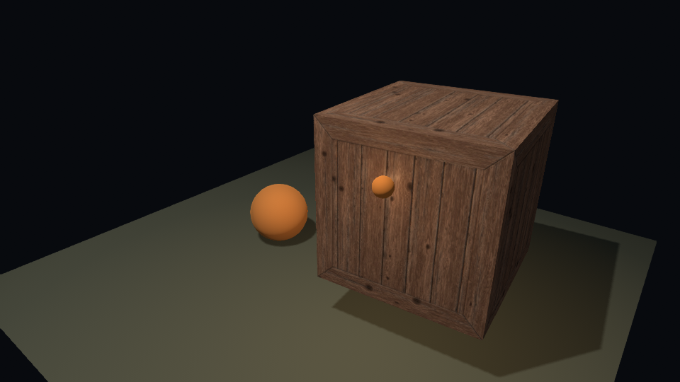

# Rune

Rune is a lightweight, code-first game engine written in Odin. Projects,
scenes, prefabs, materials, and input mappings are readable JSON files;
gameplay behavior remains Odin code.

Rune uses raylib for its platform layer, 2D rendering, input, and audio; r3d
provides the advanced 3D rendering path; and Odin's vendor bindings provide
Box2D and Box3D physics. The project remains usable without an editor: an
editor is an optional future view over the same code and JSON files.

## JSON editing

Rune schemas in `schemas/` provide completion, hover documentation, and
validation for project, scene, prefab, input, and built-in component data.
The checked-in VS Code settings associate each Rune JSON filename pattern with
its schema automatically. Custom Odin component blocks remain valid, although
their game-specific fields are not completed by the built-in schemas.

## Current capabilities

- raylib-backed engine lifecycle and registered update/draw systems;
- JSON projects, scenes, prefabs, materials, input mappings, and schemas;
- a typed ECS with reflected Odin/JSON custom components and hierarchy;
- cached, hot-reloadable texture, model, material, font, and audio assets;
- scene-owned sprites, tilemaps, text, 3D models, PBR materials, lights, and shadows;
- input actions and runtime rebinding, audio components, tweening, and navigation;
- fixed-step Box2D physics and Box3D rigid bodies;
- runtime console, gizmos, validation tools, and complete example games.

See [ROADMAP.md](ROADMAP.md) for current priorities.

## Setup

Clone with submodules so the pinned r3d Odin binding is available:

```powershell
git clone --recurse-submodules <repository-url>
```

For an existing checkout:

```powershell
git submodule update --init --recursive
```

Run the complete headless validation suite and representative builds with:

```powershell
powershell -ExecutionPolicy Bypass -File tools/validate.ps1
```

Pass `-AllExamples` to compile every launcher example.

GitLab CI runs the same all-examples validation on every branch and merge
request using the Odin release pinned in `.gitlab-ci.yml`.

## Screenshots



Additional renderer probe captures are kept in [`docs/images`](docs/images).

## Example launcher

Browse, build, and run the examples from one small launcher:

```powershell
odin run examples/launcher
```

Use the arrow keys and Enter, or the mouse, to choose an example. Each example
remains an independent Odin program and can still be run directly with its
usual `odin run examples/<name> -collection:rune=rune` command. Launcher
entries and descriptions live in `examples/examples.json`.

## Runtime lifecycle

The normal workflow registers components and systems, then lets the engine load
and own the project's startup scene:

```odin
rune.register_system(&game, rune.System{
    name = "movement",
    start = acquire_scene_state,
    fixed_update = update_physics_controls,
    update = update_gameplay,
    pre_draw = draw_background,
    draw = draw_overlay,
    on_scene_reloaded = acquire_scene_state,
    shutdown = release_game_state,
})

if !rune.run(&game) {
    fmt.eprintln(rune.last_scene_error())
}
```

The scene loop updates input, fixed-step systems and physics, normal systems,
audio, background drawing, automatic 2D scene rendering, overlay drawing,
gizmos, and the console. `pre_draw` is for custom content that must appear
behind automatic scene rendering; normal UI and debug drawing belongs in
`draw`.
`rune.run(&game, on_update, on_draw)` remains available as a low-level callback
loop for focused utilities and probes that intentionally do not use an
engine-owned scene or registered systems.

Change the engine-owned scene from a system with a project-relative path:

```odin
if !rune.change_scene(game, "scenes/level_2.scene.json") {
    fmt.eprintln(rune.last_scene_error())
}
```

The new scene is loaded before the current one is disturbed. Rune then runs
system shutdown callbacks, destroys the old World, installs the new World, and
runs start callbacks. A load failure leaves the current scene running.

`Transform`, `SpriteRenderer`, `MeshRenderer`, `SphereRenderer`, `Camera2D`, `Camera3D`, `AudioListener`, and `AudioPlayer` are data
components. Their behavior stays in Odin systems, rather than turning scene
JSON into scripts.

The engine caps simulation delta time at 0.1 seconds. Native window dragging
can pause a raylib frame loop; capping the resumed frame prevents movement and
physics from jumping across the world. Rendering still pauses while the OS owns
the window-drag operation.

## Registered systems

Systems are ordered Odin behavior over component data. `start` runs after a
scene exists, and `shutdown` runs before its World is destroyed. Scene changes
therefore receive the same lifecycle as startup and application shutdown.

```odin
rune.register_system(&game, rune.System{
    name = "movement",
    update = movement_system,
})
rune.run(&game)
```

```powershell
odin run examples/registered_systems -collection:rune=rune
```

## Runtime console

Every Rune engine instance includes a lightweight developer console. Press the
grave/backtick key (`` ` ``) to open it, `Esc` to close it, and use the up/down
arrows to navigate command history. The built-in `help` and `clear` commands
are always available. The console is rendered after game draw callbacks and
registered draw systems, so it remains visible over both 2D and 3D scenes.

Register game-specific commands from Odin. Command handlers own the game
behavior; the JSON formats remain declarative.

```odin
import "rune:console"

spawn_command :: proc(dev_console: ^console.Console, arguments: string) {
    console.info(dev_console, "Spawn requested")
    // Create game entities here.
}

dev_console := rune.developer_console(&game)
console.register(dev_console, "spawn", "Spawn a test entity.", spawn_command)
console.info(dev_console, "Game initialized")
```

The overlay handles text entry, but it does not automatically suppress project
input actions. A gameplay system that needs exclusive controls should check
`console.is_open(rune.developer_console(game))` and skip its input handling
while the console is open.

Runtime asset failures are written to stderr and copied into this console. The
message identifies the asset type, load or reload operation, source material or
component field, referenced path, and fallback behavior. Repeated failures are
deduplicated until that asset successfully loads again; invalid hot-reload
replacements keep the last working texture, font, material, or model.

## Runtime gizmos

Rune includes a small debug visualization layer for scene data. In projects
using the scene-owning `rune.run`, gizmos are disabled by default; press `F3` to toggle
them at runtime. The overlay can
draw transform axes, active and inactive cameras, 2D and 3D collision bounds,
tilemap solid cells, audio listener/player ranges, and light positions,
directions, ranges, and spot cones. It renders after
registered draw systems and before the developer console.

Projects can set the startup defaults in `project.json`:

```json
"gizmos": {
  "enabled": false,
  "transforms": true,
  "cameras": true,
  "physics_2d": true,
  "physics_3d": true,
  "tilemaps": true,
  "audio": true,
  "lights": true,
  "transform_size": 24
}
```

Callback-based examples can draw the same overlay explicitly:

```odin
rune.draw_gizmos(game, &world)
```

## Tweening and easing

`rune:tween` is a small code-only utility for transient interpolation such as
camera motion, UI fades, and gameplay feedback. It is not a scene component:
JSON continues to describe initial state, while Odin systems decide when a
tween begins. Create and update tween instances from a game's update callback
or registered update system.

```odin
import "rune:tween"

move := tween.make(0.35, tween.ease_out_cubic)

// In an update callback:
tween.update(&move, game.delta_time)
position := tween.value_vec2(&move, {0, 0}, {300, 120})
```

The package supplies linear, sine, quad, cubic, quart, back, bounce, and
elastic easing functions, along with scalar, 2D-vector, 3D-vector, and float
RGBA color interpolation. Set `mode` to `.Restart` or `.Ping_Pong` and
`repeat` to the number of additional passes (`-1` repeats indefinitely) when
needed. Run its non-windowed validation with:

```powershell
odin run tools/tween_validation -collection:rune=rune
```

The runnable [`tweening_2d`](examples/tweening_2d) example loads an orb from
scene JSON, then uses a ping-pong tween to animate its position and color.
Left-click to cycle through easing equations:

```powershell
odin run examples/tweening_2d -collection:rune=rune
```

[`scene_transition_2d`](examples/scene_transition_2d) demonstrates replacing
the runtime `World` with another JSON scene. A left click fades to black,
loads the next scene, then fades back in:

```powershell
odin run examples/scene_transition_2d -collection:rune=rune
```

[`third_person_3d`](examples/third_person_3d) demonstrates a code-driven
third-person controller: the player and active camera are separate JSON
entities, while Odin moves the player relative to camera yaw and updates the
follow camera. The JSON scene supplies `CharacterController`, static
`BoxCollider`, and `SphereCollider` components. Use WASD to move, Space to
jump, use the mouse wheel to zoom, hold the left mouse button to orbit only
the camera, or hold the right mouse button to orbit and turn the player.

```powershell
odin run examples/third_person_3d -collection:rune=rune -collection:r3d=third_party/r3d-odin
```

## Project display settings

`project.json` can set the window clear color as an RGBA byte array. Projects
without this field retain the default white background.

```json
"background_color": [48, 48, 48, 255]
```

Enable raylib's 4× MSAA hint for smoother geometry edges before the window is
created:

```json
"window": {
  "msaa_4x": true
}
```

The default is `false`. MSAA availability is platform and graphics-driver
dependent; raylib falls back when the requested framebuffer cannot be created.

## Input actions

Each project may point `input` at an input mapping JSON file. The engine loads
and validates it during `rune.init`, then samples its bindings before every
`on_update` callback. Actions support one or more keyboard or gamepad-button
bindings; axes combine two named actions into a signed value.

```json
{
  "actions": {
    "move_left":  [{ "type": "keyboard", "key": "A" }],
    "move_right": [{ "type": "keyboard", "key": "D" }],
    "jump": [{ "type": "gamepad_button", "button": "A", "gamepad": 0 }]
  },
  "axes": {
    "move_x": { "negative": "move_left", "positive": "move_right" }
  }
}
```

Query the state from an update system. `is_down`, `pressed`, `released`, and
`strength` apply to actions; `axis` returns a value from `-1` to `1`.

```odin
import "rune:input"

move_x := input.axis(rune.input_state(game), "move_x")
if input.pressed(rune.input_state(game), "jump") {
    // Start a jump.
}
```

Keyboard names currently include letters, digits, arrows, `SPACE`, `ESCAPE`,
`ENTER`, `TAB`, `BACKSPACE`, shift, and control. Mouse buttons use `LEFT`,
`RIGHT`, or `MIDDLE`. Gamepad buttons use readable names such as `A`, `B`,
`X`, `Y`, `DPAD_UP`, `LEFT_BUMPER`, and `START`.

## Runtime key rebinding

Game code can replace an action's keyboard binding at runtime. This preserves
any mouse or gamepad bindings declared for that action, and axes automatically
use the new action state on the next input update.

```odin
controls := rune.input_state(game)
if input.rebind_keyboard(controls, "move_left", "LEFT") &&
   input.rebind_keyboard(controls, "move_right", "RIGHT") {
    input.save(controls) // Writes the JSON input file loaded by the project.
}
```

The runnable [`runtime_rebinding`](examples/runtime_rebinding) sample starts
with `A`/`D` movement. Press `R` to switch it to Left/Right arrows and press
`R` again to restore `A`/`D`; each change is saved to
`input/default.input.json`:

```powershell
odin run examples/runtime_rebinding -collection:rune=rune
```

Mouse motion can be exposed as an axis using `"type": "mouse_delta"` and
`"axis": "x"` or `"y"`. Its value is the mouse movement sampled for the
current frame; optional `scale` and `invert` fields may be provided. For
example, `{ "type": "mouse_delta", "axis": "y", "invert": true }`
reverses vertical mouse movement.

Mouse-wheel input is available as `{ "type": "mouse_wheel" }`; it returns
the wheel movement sampled for the current frame and also supports `scale` and
`invert`. The third-person example uses it to zoom its follow camera.

`third_party/r3d-odin` is pinned to r3d `v0.10.0`. Rune uses the bundled Odin
raylib binding for windowing, input, audio, 2D rendering, and debug overlays;
3D examples now render scene data through `rune/r3d_bridge`.

## Run the example

From the repository root on Windows:

```powershell
odin run examples/hello_world -collection:rune=rune
```

The example loads `project.json`; `scene.load` then reads `scenes/main.scene.json` and returns its populated runtime `World`.

## Project validation

Use the non-windowed validator before running a project or in CI. It follows
the startup scene and its prefabs, checks entity IDs and layers, confirms
referenced input, material, and asset files exist, validates model material-slot
overrides, and rejects texture formats unavailable in the bundled raylib build.
Failures are reported as `file: $.json.path: message`.

```powershell
odin run tools/project_validator -collection:rune=rune -- examples/hello_world/project.json
```

The project path is optional and defaults to the hello-world example. Runtime
project and scene loading use the same structural validation before creating a
window or world.

`rune.init` owns its loaded project and input data and releases both during
`rune.shutdown`. Standalone tools that call `rune.load_project` or `input.load`
directly must pair them with `rune.destroy_project` or `input.destroy`.

## Custom components

`rune.init` automatically creates the component registry and registers the
built-ins. Register gameplay components with an Odin struct before loading a
scene. Rune reflects the struct to validate and deserialize the matching JSON
component, while game code continues to own all behavior.

```odin
Health :: struct {
    current: i32,
    maximum: i32 `json:"max"`,
}

ecs.register_component(
    rune.component_registry(&game),
    "Health",
    Health,
    Health{current = 100, maximum = 100},
    "Hit points for damageable entities",
)
```

An untagged field uses its exact Odin member name; a `json:"..."` tag overrides
that name. Omitted properties retain registered defaults and unknown properties
fail validation. Scene loading also rejects unregistered component names, so a
misspelling cannot silently create a new component. Deliberately untyped data
uses the explicit `ecs.register_data_component` compatibility API.

The typed built-ins are `Transform`, `SpriteRenderer`, `MeshRenderer`,
`SphereRenderer`, `Camera2D`, `Camera3D`, `AudioListener`, and `AudioPlayer`. Cameras use their entity's
`Transform` for their position; only one camera of a given kind should be
active at a time. Custom-component systems can read and modify `Transform` by
entity ID:

```odin
transform, ok := ecs.get(&world, entity, ecs.Transform)
if ok {
    transform.position[0] += speed * dt
    ecs.set(&world, entity, transform)
}
```

Queries resolve serialized names from registration and match component sets
without repeating strings:

```odin
for entity in ecs.query2(world, ecs.Transform, Mover) {
    transform, _ := ecs.get(world, entity, ecs.Transform)
    mover, _ := ecs.get(world, entity, Mover)
}
```

`ecs.destroy_entity` recursively removes an entity, its children, components,
audio instances, and native physics bodies. `ecs.change_version` and
`ecs.changes_since` expose added, changed, and removed component events from
scene reload, runtime creation, `ecs.set`, and destruction. Typed World-wide
system state can live in `ecs.add_resource` / `ecs.resource` instead of globals.

## Audio component data

`AudioListener` selects the scene audio reference point and normally belongs on
the active camera entity. `AudioPlayer` belongs on entities that emit sounds.
The sound path is project-relative; Odin audio systems own playback commands.
The runtime initializes raylib audio, loads one independent sound instance per
named player component, honors `play_on_start`, and restarts looping sounds. Spatial
players use listener-relative distance attenuation and world-X panning as an
initial simple mixer; orientation-aware 3D audio can replace this later.

```json
"AudioListener": { "active": true }
```

```json
"AudioPlayer": {
  "bell": {
    "sound": "assets/audio/bell.wav",
    "volume": 0.75,
    "pitch": 1.0,
    "random_volume": 0.1,
    "random_pitch": 0.05,
    "max_voices": 4,
    "looping": false,
    "spatial": true,
    "min_distance": 1.0,
    "max_distance": 20.0,
    "play_on_start": false
  }
}
```

`AudioPlayer` is repeatable: every instance requires a unique name such as
`bell`, `shoot`, or `explode`. Pass that name to the playback API.
`random_volume` and `random_pitch` independently sample a variation in the
inclusive range `-amount` to `+amount` whenever playback starts. Final volume
is clamped to zero and final pitch remains positive. Buffered one-shots use up
to `max_voices` simultaneous voices (default 4), preferring an idle voice and
otherwise replacing the oldest. Looping sounds and streamed music use one voice.

Use `ecs.active_audio_listener` and `ecs.set_active_audio_listener` to manage
the selected listener. Scenes should declare one active listener; the ECS does
not require that listener to carry a camera component.

The runnable component-loading example is available at:

```powershell
odin run examples/audio_components -collection:rune=rune -collection:r3d=third_party/r3d-odin
```

When using the scene-owning `rune.run`, the engine updates audio automatically. Odin
systems can trigger a configured player explicitly with
`rune.play_audio(game, world, entity, "bell")` and stop it with
`rune.stop_audio(game, entity, "bell")`.

## Entity tags and layers

Entity identity and filtering data are base World metadata, rather than ECS
components. Scene entities may declare an optional `tag` and zero or more named
`layers`. A missing `layers` field puts the entity in the implicit `Default`
layer (bit 0).

```json
{
  "id": "player",
  "name": "Player",
  "tag": "player",
  "layers": ["Gameplay", "Player"],
  "components": {}
}
```

`Default` is built in at bit 0. Projects define only additional names in
`project.json`; their positions must be between 1 and 63:

```json
"layers": {
  "Gameplay": 1,
  "Player": 2
}
```

Normal game code loads through the engine, which supplies the project's layer
table so named layers are validated and resolved into a `u64` mask:

```odin
world, ok := rune.load_scene(&game, scene_path)
```

`scene.load` remains available for standalone tools and resolves the built-in
`Default` layer without project configuration. Tools that load project-named
layers can use `scene.load_with_layers`.

Systems can resolve a scene ID once with `ecs.find_entity_by_id` and cache the
returned runtime handle for that World. IDs are unique when non-empty; names
are display metadata and may be duplicated. Systems can inspect metadata with `ecs.entity_id`, `ecs.entity_name`,
`ecs.entity_tag`, `ecs.has_tag`, `ecs.entity_layer_mask`, and
`ecs.is_in_layer_mask`. Tags are one optional string; layers are a bitmask and
are suitable for later render, camera, collision, and editor filtering.

## Scene-owned rendering

r3d-backed scene rendering walks the entity hierarchy, combines parent and child
`Transform` data, and draws supported 3D render components through
`rune:r3d_bridge`. A normal game system therefore only changes component data;
it does not draw a `MeshRenderer`/`SphereRenderer` itself.

```odin
r3d_bridge.draw_scene_ex(&bridge, &world, rune.asset_manager(game), scene_view)
```

`MeshRenderer` currently draws the `cube` primitive and `SphereRenderer` draws
a sphere through r3d. `SpriteRenderer` loads a project-relative texture path
through the asset cache and is drawn automatically through the active
`Camera2D`. Callback-based loops can still call `render.draw_scene_2d`.

Missing sprite textures use a shared magenta fallback texture rather than
retrying disk loading every frame.

Validate scene-to-typed-transform loading without starting a game window:

```powershell
odin run tools/component_validation -collection:rune=rune
```

## 3D hello world

The 3D sample loads a JSON scene and shows a rotating cube with a perspective camera:

```powershell
odin run examples/hello_3d -collection:rune=rune -collection:r3d=third_party/r3d-odin
```

## JSON sprite scene

This separate 2D example defines a game-owned `TiledWall` component in scene
JSON for the `wallDark.png` background, then renders a randomly moving
`skeletonWarrior.png` `SpriteRenderer` through the active `Camera2D` and the
engine texture cache:

```powershell
odin run examples/sprite_scene_2d -collection:rune=rune
```

## Prefabs

Scenes can instantiate a prefab using a path relative to the scene file. The
instance keeps scene-owned metadata such as `id`, `name`, `tag`, and `layers`;
its `components` replace matching prefab component blocks. This initial slice
supports prefab child entities, but not nested prefab references or child-level
overrides.

```json
{
  "id": "skeleton_left",
  "prefab": "../prefabs/skeleton.prefab.json",
  "components": {
    "Transform": { "position": [180, 270, 0], "scale": [3, 3, 1] }
  }
}
```

Run the multiple-instance example with:

```powershell
odin run examples/prefabs_2d -collection:rune=rune
```

Validate prefab scene loading without opening a window:

```powershell
odin run tools/prefab_validation -collection:rune=rune
```

## Development hot reload

Configure modified-time polling in `project.json`. These values default to the
following when the block is omitted:

```json
"hot_reload": {
  "enabled": true,
  "poll_interval_ms": 250,
  "scenes": true,
  "prefabs": true,
  "textures": true,
  "models": true
}
```

Texture reload respects `textures`. The normal engine-owned `rune.run(&game)`
workflow watches the active scene automatically. Component-value-only edits
are applied to the existing World; structural edits rebuild it and invoke each
system's `on_scene_reloaded` callback so cached entity handles can be
reacquired.

Advanced callback-based programs that own a World can poll explicitly:

```odin
if rune.reload_scene_if_changed(game, &world, "scenes/main.scene.json") {
    // Reacquire any Entity values cached by this game.
}
```

The helper respects `enabled`, `scenes`, and `prefabs`, and watches the scene
JSON plus directly referenced prefab files when configured to do so.

`Entity` values are generation-checked runtime handles. A handle from the old
world is therefore safely rejected after scene reload instead of accidentally
referring to a different entity at the same numeric index. For references that
must survive reload, give the entity a stable JSON `id` and retain an
`ecs.Entity_Ref`:

```odin
player, _ := ecs.find_entity_by_id(&world, "player")
player_ref, _ := ecs.entity_ref(&world, player)

// After a scene reload:
player, found := ecs.resolve_entity_ref(&world, player_ref)
```

Readable IDs such as `"player"` are suitable for hand-authored projects.
Editor tooling may generate UUID-shaped IDs later without changing this API.

## Asset-backed 3D models

`ModelRenderer` loads a model through the project asset cache and renders it
with the entity `Transform` through the active `Camera3D`:

```json
"ModelRenderer": {
  "model": "assets/models/pyramid.obj",
  "material": "assets/materials/pyramid.material.json"
}
```

Material files are project-relative JSON assets. `base_color` tints primitives
and models; `albedo` applies a diffuse texture; `normal` applies a tangent-space
normal map; and scalar `roughness`/`metallic` values map into r3d materials.
The older `texture` field remains an alias for `albedo`:

```json
{
  "base_color": [230, 190, 92, 255],
  "albedo": "assets/textures/stone.png",
  "normal": "assets/textures/stone_normal.png",
  "roughness_texture": "assets/textures/stone_roughness.png",
  "ao_texture": "assets/textures/stone_ao.png",
  "height_texture": "assets/textures/stone_height.png",
  "filter": "anisotropic_8x",
  "mipmaps": true,
  "lod_bias": 0.5
}
```

Material textures default to mipmaps plus `anisotropic_8x` filtering, which is
the normal choice for 3D models viewed at oblique angles. Use `"filter":
"point"` and `"mipmaps": false` only for deliberately pixelated assets. If a
high-frequency texture still shimmers in motion, use a small positive
`lod_bias` value to sample a softer mip level.

Use PNG, BMP, GIF, QOI, or DDS texture files. The project validator reports
other extensions before the game reaches runtime.

Set `"lighting": true` for normal r3d lighting, or `"lighting": false` for
unlit materials. The r3d bridge maps `albedo`, `normal`, `base_color`,
`roughness`, and `metallic`; separate roughness, metallic, and AO textures are
packed into a runtime ORM texture. Height textures remain authoring metadata
until the renderer gains parallax or displacement support:

```json
{
  "base_color": [230, 190, 92, 255],
  "lighting": true,
  "roughness": 0.42,
  "metallic": 0.08,
  "roughness_texture": "assets/textures/stone_roughness.png",
  "ao_texture": "assets/textures/stone_ao.png",
  "height_texture": "assets/textures/stone_height.png",
  "height_scale": 0.035
}
```

Imported models with UVs and normals render through r3d's material pipeline.

Scenes provide light data with JSON components:

```json
"AmbientLight": { "color": [120, 150, 210, 255], "intensity": 0.18 },
"DirectionalLight": {
  "direction": [-0.45, -1, -0.35],
  "color": [255, 238, 205, 255],
  "intensity": 1.15
},
"PointLight": { "color": [255, 165, 90, 255], "intensity": 2.2, "range": 5 },
"SpotLight": {
  "direction": [0.62, -0.53, -0.59],
  "color": [130, 190, 255, 255],
  "intensity": 3,
  "range": 7,
  "inner_angle": 16,
  "outer_angle": 30
}
```

r3d owns the active light budget and shading path. `PointLight` and
`SpotLight` positions come from the entity `Transform`; `SpotLight.direction`
points from the light toward the center of its cone.

`MeshRenderer`, `SphereRenderer`, and `ModelRenderer` can reference materials
with a `material` field. `hot_reload.models` controls modified-time model
refresh, and `hot_reload.materials` controls material JSON refresh. The
built-in `MeshRenderer` and `SphereRenderer` remain useful debug primitives.
For imported models with multiple material slots, `ModelRenderer.material` acts
as the fallback and `ModelRenderer.materials` can override individual zero-based
r3d material slots:

```json
"ModelRenderer": {
  "model": "assets/models/room.obj",
  "material": "assets/materials/default.material.json",
  "materials": {
    "0": "assets/materials/walls.material.json",
    "1": "assets/materials/floor.material.json"
  }
}
```

Run the self-contained OBJ example with:

```powershell
odin run examples/model_scene_3d -collection:rune=rune -collection:r3d=third_party/r3d-odin
```

The `textured_model_3d` example adds a UV-mapped cube model and a textured,
lit material:

```powershell
odin run examples/textured_model_3d -collection:rune=rune -collection:r3d=third_party/r3d-odin
```

The bridge is intentionally small for now. Rune scene loading, ECS, input,
orbit camera controls, hot reload, light gizmos, and JSON authoring remain the
engine layer; r3d owns the heavier 3D drawing path.

## Basic 3D collision

`BoxCollider` provides static axis-aligned world collision. `SphereCollider`
provides a conservative sphere-shaped static volume whose radius follows the
largest Transform scale axis. `CharacterController` adds gravity, grounded
state, and jumping while keeping its entity Transform at the camera eye
position. Colliders only interact when their entity layer masks overlap.

```json
"BoxCollider": { "size": [1, 1, 1], "is_static": true }
```

```json
"SphereCollider": { "radius": 0.75, "is_static": true }
```

```json
"CharacterController": {
  "radius": 0.35,
  "height": 1.8,
  "eye_height": 1.6,
  "gravity": 24,
  "jump_speed": 8
}
```

The first-person example now has collidable blockout geometry. Use WASD to
move, Space to jump, and Escape to release/capture the cursor. Green outlines
show static collision boxes.

## 2D tilemaps

`TilemapRenderer` draws a JSON grid from a texture atlas. Each non-negative
cell selects an atlas tile; `-1` leaves that cell empty.

```json
"TilemapRenderer": {
  "texture": "assets/tiles/dungeon.png",
  "tile_size": [16, 16],
  "grid": [[0, 0, -1], [0, 1, 0]]
}
```

Run the example with:

```powershell
odin run examples/tilemap_2d -collection:rune=rune
```

`TilemapCollider` uses the same grid and blocks indices in `solid_tiles`.
`TopDownController` gives an entity a 2D collision size and movement speed;
game code supplies input deltas to `ecs.move_top_down`, which resolves X and Y
separately for wall sliding. Run the collision example with:

```powershell
odin run examples/tilemap_collision_2d -collection:rune=rune
```

## Fixed-step 2D physics

`RigidBody2D` is an engine-owned JSON component backed by Odin's `vendor:box2d`
package.
The runtime synchronizes its velocity and Transform at a fixed 60 Hz, while
Box2D handles dynamic contacts, friction, and continuous collision. An entity
with a collider but no `RigidBody2D` becomes static collision geometry.

```json
"RigidBody2D": { "gravity_scale": 1.0 },
"BoxCollider2D": { "size": [26, 30] }
```

The scene-owning loop advances physics automatically. Gameplay that controls a
body belongs in a system's `fixed_update`; `grounded` is set after a body lands,
which makes jumping an explicit game-code decision. Callback-based programs may
still call `ecs.physics_2d_update` directly. Run the example and validation:

```powershell
odin run examples/physics_platformer_2d -collection:rune=rune
odin run tools/physics_2d_validation -collection:rune=rune
```

## Scene text

`TextRenderer` draws font-backed text through an entity `Transform` and the
active `Camera2D`. Fonts are cached with textures and refresh when their file
changes.

```json
"TextRenderer": {
  "text": "WASD: move",
  "font": "assets/fonts/mecha.png",
  "font_size": 18,
  "color": [255, 255, 255, 255]
}
```

## Multiple camera switching

The camera-switching sample has three `Camera3D` entities loaded from JSON.
Press `1`, `2`, or `3` to select the wide, front, or side camera:

```powershell
odin run examples/camera_switching -collection:rune=rune -collection:r3d=third_party/r3d-odin
```

## Orbit camera

`OrbitCamera3D` is a JSON-backed controller for an entity that also has
`Transform` and `Camera3D`. It updates the camera position around a target,
optionally auto-orbits when the manual action is not held, and can read input
axes for yaw, pitch, and zoom:

```json
"OrbitCamera3D": {
  "target": [0, 0.75, 0],
  "distance": 8,
  "pitch": 27,
  "auto_yaw_speed": 35,
  "manual_action": "orbit_camera",
  "yaw_axis": "orbit_x",
  "pitch_axis": "orbit_y",
  "zoom_axis": "zoom"
}
```

Projects using the scene-owning `rune.run` update orbit cameras automatically before
registered systems run. Callback-based programs can call
`rune.update_orbit_cameras_3d(game, &world)`. Hold the left mouse button and
drag in the orbit-camera example to control the orbit:

```powershell
odin run examples/orbit_camera -collection:rune=rune -collection:r3d=third_party/r3d-odin
```

## First-person controller

This noclip 3D sample demonstrates a game-owned `FirstPersonController`
component declared in scene JSON. Its Odin system reads project input actions,
updates the camera entity's `Transform`, and updates its `Camera3D.target`.

```powershell
odin run examples/first_person_3d -collection:rune=rune -collection:r3d=third_party/r3d-odin
```

Use WASD to move, Shift to sprint, and mouse movement to look. Escape releases
or recaptures the cursor. Collision, gravity, and jumping are intentionally
deferred until a physics/collision slice exists.

## Solar-system hierarchy

This sample shows nested scene entities and transform inheritance: `Sun > Earth > Moon`.

```powershell
odin run examples/solar_system -collection:rune=rune -collection:r3d=third_party/r3d-odin
```

## Custom component updating a Transform

This example registers the game-defined `Mover` component as an Odin struct:

```odin
Mover :: struct {
    speed: f32,
}

ecs.register_component(
    rune.component_registry(&game),
    "Mover",
    Mover,
    Mover{speed = 120},
    "Horizontal movement speed",
)
```

Untagged fields use their exact Odin member name in JSON, so `speed` maps to
`"speed"`. Use an Odin `json:"..."` struct tag only when the JSON name should
differ. Missing properties retain the registered defaults; unknown properties,
including unknown properties in nested structs, make scene loading fail.

Systems read and update the stored struct without converting through
`json.Value`:

```odin
mover, found := ecs.get(world, entity, Mover)
if found {
    mover.speed = 240
    ecs.set(world, entity, mover)
}
```

When scene hot reload changes a component property, Rune deserializes and
validates a replacement struct, then swaps it into the existing World while
preserving the entity handle.

```powershell
odin run examples/custom_mover -collection:rune=rune
```

## Tetris

The `tetris` example is a complete code-driven game using Rune's project,
scene, system, and input APIs. It includes all seven tetrominoes, scoring,
levels, next-piece and ghost previews, pause, and restart:

```powershell
odin run examples/tetris -collection:rune=rune
```
