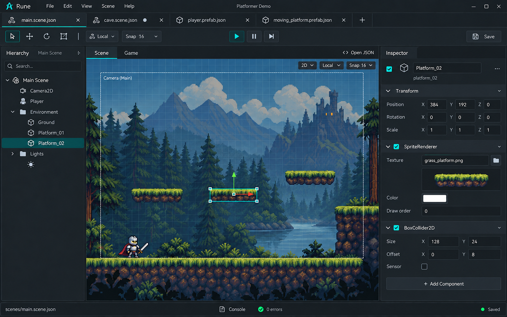

# Rune editor

Design notes captured on 2026-09-16. This directory contains the editor concept
and visual reference; it does not yet contain an editor implementation.

Rune's editor will be an optional visual tool for authoring the same readable
scene and prefab JSON files used by the runtime. Projects remain usable through
Odin code and hand-edited files. Gameplay behavior stays in Odin.

## Current mockup

[Open the full-size mockup](mockups/editor-tabs.png). Generated with the built-in
image generation tool as a UI concept, not a screenshot of working software.
The sample level, filenames, controls, and values are illustrative.

## Decisions so far

- **Keep assets in the operating system.** There is no built-in asset browser,
  folder tree, or asset-management dock. Use the OS file manager to organize
  files. Component asset fields can expose an editable path, an OS file picker,
  and a preview of the assigned asset.
- **Use document tabs for scenes and prefabs.** Multiple scene files and prefab
  files can remain open together. Switching the active document updates the
  hierarchy, viewport, and inspector as one workspace.
- **Keep the viewport prominent.** The hierarchy occupies the left side and
  the inspector the right; the center extends down to a compact status bar.
- **Save back to ordinary JSON files.** The editor is a view over project data,
  with no required editor-owned project database or separate runtime format.
- **Use an HTML/CSS shell with native Rune viewports.** Cross-platform web UI
  provides the editor chrome; Rune renders scenes and games. A small bridge
  connects them without duplicating engine state. Selection, picking, gizmos,
  and editor cameras belong to an editor-only overlay/runtime layer.
- **Restore the editor workspace independently.** Open scene/prefab tabs and
  the active document are editor state, separate from the game's startup scene.
- **Make prefab source edits explicit.** Selecting an instance edits its
  overrides. Edit Prefab Source opens a separate document. Overrides remain
  visible and support apply/revert operations; other instances keep their own
  overrides when the source changes.
- **Discover components through Rune.** Add Component and the inspector use
  the loaded project's live component registry and reflection metadata for both
  built-in and custom components, without a hard-coded list or source scanning.
- **Separate edit and play persistence.** Edit-mode component changes persist
  to the appropriate document; play-mode changes affect the live entity without
  saving back by default.
- **Keep code editing external and JSON accessible.** Edit Source opens a
  configurable external editor using source metadata. Enhanced JSON editing
  can add controls for known values while retaining readable, editable text.

See the [living design notes](rune-editor-design-notes.md) for the detailed
architecture, nested prefab boundaries, override operations, and metadata goals.
These are design decisions; the editor is not yet implemented.

## Interface concept

| Area | Intended role |
| --- | --- |
| Menu bar | Project and document operations, editing, view settings, and help. |
| Document tabs | Open scenes and prefabs, with type icons, close buttons, an active-tab highlight, and unsaved-change indicators. |
| Toolbar | Selection and transform tools, local/world controls, snapping, Save, and proposed Play/Pause/Step controls. |
| Hierarchy | Entities and parent/child relationships in the active document, with search and selection. |
| Viewport | Visual selection and placement, move/rotate/scale handles, grid, snapping, camera bounds, and zoom. |
| Inspector | Selected entity identity and component fields, asset references, and component add/remove actions. |
| View controls | Scene/Game mode switch within the document workspace and an Open JSON action. |
| Status bar | Active file path, access to the console, error count, and save status. |

The top document tabs are separate from the Scene/Game view switch. A prefab
opens as its own document, rather than replacing or closing its containing
scene. The mockup illustrates two scene tabs and two prefab tabs.

The visual direction is a compact dark interface with restrained teal accents,
clear labels, and subtle panel boundaries. The 2D platformer is a layout example;
it does not settle the editor's initial 2D/3D scope. The HTML/CSS shell and native
Rune rendering direction comes from the living design notes.

## Proposed first editing workflow

1. Open a project and select a scene or prefab through an OS file picker.
2. Keep additional scenes and prefabs open in document tabs.
3. Select an entity in the hierarchy or viewport.
4. Adjust its transform with handles or edit component fields in the inspector.
5. Assign an asset using its path or an OS file picker.
6. Save the active document back to its source JSON file.
7. Run the game to verify the result.

Basic authoring ideas discussed include adding/removing components, duplicating
and deleting entities, and undo/redo. These remain proposed implementation work.

## Questions to resolve before implementation

- Shell implementation: choose the HTML/CSS host, native rendering integration,
  and bridge protocol. Windows and Linux remain equal targets.
- Document state: per-document selection, viewport state, undo history, save
  behavior, and handling an unsaved document when closing a tab.
- External edits: reconciliation between unsaved editor changes and files
  modified by a text editor or other tool.
- Prefab editing: preview context and how source changes refresh already-open
  scenes while preserving instance overrides. Define the confirmed bulk action
  that applies to the source and clears matching overrides across instances.
- Play mode: which scene runs, whether it uses saved or unsaved data, and what
  the Game view and Play/Pause/Step controls mean for a prefab document.
- Custom components: how the host loads the game's registry and transports
  field metadata, editor hints, and source locations through the bridge.
- Enhanced JSON: control behavior, synchronization with the inspector, and
  whether Open JSON opens the internal document view or the external editor.
- File associations: finalize semantic extensions (such as `.rscene` and
  `.rprefab`) and containing-project discovery when opening a document.

Keep authoring state distinct from running-game state. Rune's existing runtime
console can inspect and edit live values, but those edits do not automatically
save source files; editor persistence needs an explicit design.

## References

- [Living editor design notes](rune-editor-design-notes.md)
- [Engine overview and current APIs](../README.md)
- [Roadmap](../ROADMAP.md)
- [Runtime console](../docs/runtime-console.md)
- [Mockup generation prompt](mockups/PROMPT.md)
